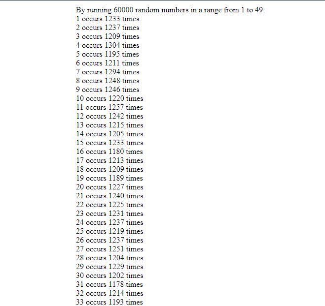

##############  Work in progress.  #################

# 6/49 Randomizer  (JavaScript)
 An app that returns top six random numbers in a range from 1 to 49 from a pool of random numbers set by user input.
 In the example below, app created 60000 random numbers in the range, and counted how many times each number occured.
 
## Sample output

## To do:

 [ ] Create key:value pairs

 [ ] Sort by values
 
 [ ] Select top six
 
 [ ] Add User Input box 
 
 [ ] Add "Submit" button which will send user input number to a function that will return random numbers
 
 [ ] Output "Top Six" random numbers
 
 [ ] Add styling to the page
 
 [ ] Add input validation
 
 [ ] Test
 

